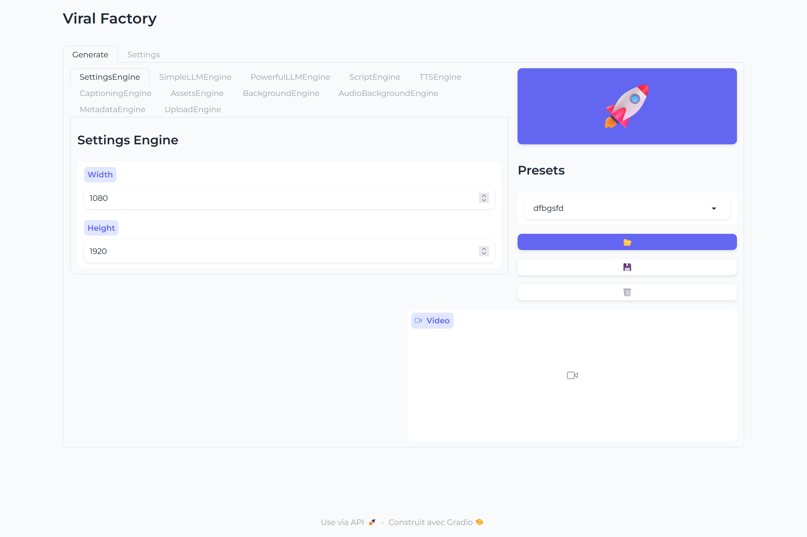

<br/>
<p align="center">
  <h1 align="center">Viral Factory <picture></picture></h1>

  <p align="center">
    Viral Factory is a highly modular <a href="https://github.com/gradio-app/gradio">gradio</a> app that <strong>automates</strong> the production of various forms of <strong>social media content</strong>. Thanks to it's complex engines system it allows you to customize it's process in detail.
    <br/>
    <br/>
    <a href="https://github.com/Paillat-dev/viralfactory/issues">Report Bug</a>
    .
    <a href="https://github.com/Paillat-dev/viralfactory/issues">Request Feature</a>
  </p>
</p>

<picture>
  
</picture>
<picture>
  
</picture>
<picture>
  
</picture>

## Table Of Contents

* [About the Project](#about-the-project)
* [Built With](#built-with)
* [Getting Started](#getting-started)
  * [Prerequisites](#prerequisites)
  * [Installation](#installation)
* [Usage](#usage)
* [Roadmap](#roadmap)
* [Contributing](#contributing)
* [License](#license)
* [Authors](#authors)
* [Acknowledgements](#acknowledgements)

## About The Project



Viral Factory is a **highly modular** [gradio](https://github.com/gradio-app/gradio) app that **automates** the production of various forms of **social media content** with custom pipelines to allow for custom usage.

It can handle, **notably:**
- Writing scripts
- Text to Speech
- Assets retrieval
- Video Backgrounds
- Audio Backgrounds
- Upload to TikTok and YouTube


## Built With

Thiw project was built with ❤️ and with

* [Gradio](https://github.com/gradio-app/gradio)
* [🐸TTS](https://github.com/coqui-ai/TTS)
* [moviepy](https://github.com/Zulko/moviepy)
* [whisper-timestamped](https://github.com/linto-ai/whisper-timestamped)

## Getting Started


### Prerequisites

Currently, an Nvidia gpu with at least around 10 GB of vram is required for this project to work in optimal conditions, and at minima 20 GB of free disk storage.
You will need as well to have the following software installed (click on them to install):
- [CUDA 11.8](https://developer.nvidia.com/cuda-11-8-0-download-archive)
- [ffmpeg](https://ffmpeg.org/download.html)
- [git](https://git-scm.com/downloads)
- [Python 3.10](https://www.python.org/downloads/release/python-31011/)

### Installation

Once the above requirements are installed, reboot your computer. Then, open a terminal window, navigate to where you want to install the project and run, one line at a time the following:
```bash
git clone https://github.com/Paillat-dev/viralfactory
cd viralfactory
py -3.10 -m venv venv
.\venv\Scripts\activate # Windows
source venv/bin/activate # Linux & MacOS
pip install -r requirement.txt
```
This might take some time, you should not worry about it seeming stuck.

## Usage

You can launch the webapp with:
```bash
.\venv\Scripts\activate # Windows
source venv/bin/activate # Linux & MacOS
python main.py
```

Watch the video below to learn more on how to use.

[](https://youtu.be/9jQa1LjbPJI)

## Roadmap

See the [open issues](https://github.com/Paillat-dev/viralfactory/issues) for a list of proposed features (and known issues).

## Contributing

Contributions are what make the open source community such an amazing place to be learn, inspire, and create. Any contributions you make are **greatly appreciated**.
* If you have suggestions, feel free to [open an issue](https://github.com/Paillat-dev/viralfactory/issues/new) to discuss it.
* Please make sure you check your **spelling and grammar**.
* Create individual PR for each suggestion.

### Creating A Pull Request

1. Fork the Project
2. Create your Feature Branch (`git checkout -b feature/AmazingFeature`)
3. Commit your Changes (`git commit -m '✨feat(Engines.LLMEngine) Add mistral local engine'`)
4. Push to the Branch (`git push origin feature/AmazingFeature`)
5. Open a Pull Request

## License

Distributed under the AGPL-3.0 license. See [LICENSE](/LICENSE) for more information

## Authors

* **Paillat-dev** - [Paillat-dev](https://paillat.dev/) - *Main author*

## Acknowledgements

* [ShaanCoding](https://github.com/ShaanCoding/)
* [Othneil Drew](https://github.com/othneildrew/Best-README-Template)
* [ImgShields](https://shields.io/)
* [RayVentura/ShortGPT](https://github.com/RayVentura/ShortGPT)
